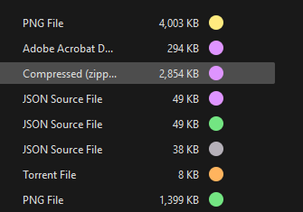
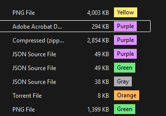
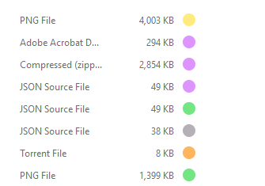
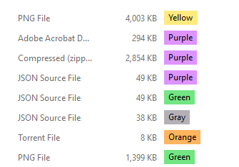
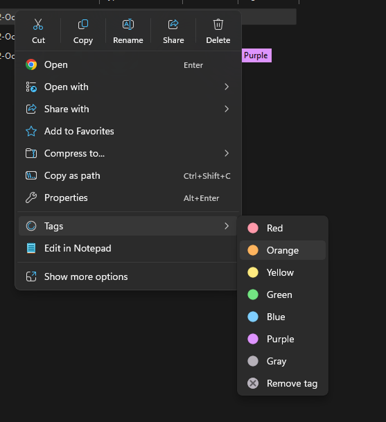
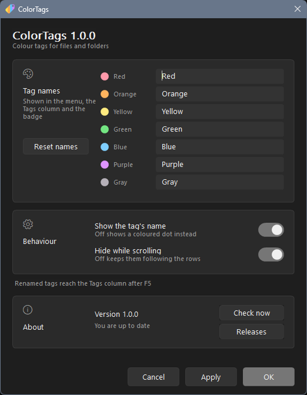

# ColorTags Explorer

Color tags for files and folders in Windows 11 File Explorer. Choose a color
from the context menu and show it as a dot or a label with your own name, such
as "work", "urgent", or "later".

ColorTags adds color to your existing Explorer windows. A small external
program draws the indicators over file rows because Explorer does not expose
a supported API for colored content in a custom column.

## Screenshots

| Colored dots | Tag labels |
| --- | --- |
| **Dark theme**<br> | **Dark theme**<br> |
| **Light theme**<br> | **Light theme**<br> |

## Features

- **Seven colors:** red, orange, yellow, green, blue, purple, and gray. Rename
  each tag; the custom name appears in the menu, column, and label.
- **Explorer context menu:** apply or remove a tag, including for several
  selected files at once.
- **Tags column in Details view:** displays the tag name in label mode. In dot
  mode the cell is empty and the external overlay draws the color.
- **Colored indicators:** show a dot or a colored label beside each tagged row.
- **Tray settings:** edit tag names, display mode, scrolling behavior, and check
  for updates.
- **Tags stored in files on NTFS:** the `:ColorTag` alternate data stream stays
  with a file when it is renamed or moved within an NTFS volume. On volumes
  without stream support, the menu uses a local SQLite database; those tags
  depend on the database on that computer.
- **Preserved modification time:** the file's modification timestamp is saved
  before writing its tag and restored afterward.

### Tagging from the context menu

Right-click a file, open **Tags**, and choose a color or **Remove tag**.



## Installation

Download a package from [Releases](https://github.com/vldpotapov/ColorTags/releases):

- **`ColorTags-Setup-*.exe`** installs the complete application: the **Tags
  context menu**, Tags column, colored indicators, and tray settings. Python
  is bundled; you do not need Python or Windows SDK installed. Setup is
  English-only, installs for the current user, and offers optional startup.
  Approve the administrator prompts for the package certificate and column
  registration. Setup closes the old overlay when updating.
- **`ColorTags-Explorer-*.zip`** includes the same runtime and signed menu
  package for manual installation. Administrator approval is still required
  for registration; Python and Windows SDK are not required on your computer.

**Upgrading from 1.0.0:** run the new installer over your existing installation.
Version 1.0.0's EXE installed only the overlay; 1.0.1 also registers the menu.
Your tags and custom labels are preserved. Reopen Explorer or sign out and
back in if it still shows the old context menu.

For the ZIP, extract the entire archive to a permanent folder. To register the
context menu and column, open PowerShell in that folder and run:

```powershell
cd ShellExtension
powershell -NoProfile -ExecutionPolicy Bypass -File .\register.ps1 -RestartExplorer
```

Keep the extracted folder in place: the menu runs the Python modules from it.
Registration trusts the supplied public MSIX certificate on the computer.
Private signing keys are never distributed. Use `unregister.ps1` to remove
the extension registration, or uninstall the EXE through Windows Settings.
If setup reports an integration error, see
`%LOCALAPPDATA%\Colortags\setup-integration.log` and rerun setup after resolving it.

To run the portable overlay, use `Overlay\Start ColorTags.cmd`; use
`Overlay\Stop ColorTags.cmd` to stop it. The overlay works without Python.

See [INSTALL.md](INSTALL.md) for additional installation and removal details.
The binaries are not code-signed, so Windows may show a SmartScreen warning.
Verify the file's source before running it.

## Settings

Left-click the tray icon to open settings. You can rename all seven tags,
choose dots or labels, hide indicators while scrolling or make them follow
the rows, and check for updates. Apply your changes with the OK button;
ColorTags refreshes the open Explorer windows.



The same settings are stored under `HKCU\Software\ColorTags`:

| Value | Meaning |
| --- | --- |
| `DisplayMode` | `0` for dots, `1` for named labels |
| `ScrollBehavior` | `hide` to hide during scrolling, `follow` to follow the rows |
| `ColumnFormat` | `label`, `emoji`, or `emoji-label` for the native Tags column |
| `Labels\<id>` | Custom tag name; empty uses the default name |
| `TraceFile` | Property-handler trace file path; empty disables tracing |

For scripting, use `src\VisualNative\Set-ColorTagsSettings.ps1`.

## How it works

ColorTags has three parts:

1. **Storage:** writes a UTF-8 tag without a BOM to the `:ColorTag` alternate
   data stream. A local SQLite database provides fallback storage on volumes
   without stream support.
2. **Shell extension** (`ColorTagsMenu.dll`): provides an `IExplorerCommand`
   context menu and a property handler that exposes the Tags column through
   `System.Keywords`. The menu is registered through an MSIX package.
3. **Visual overlay** (`ColorTagsOverlay.exe`): a separate layered window over
   Explorer. It uses UI Automation to locate rows and
   `IShellWindows`/`IFolderView` to resolve file paths. It does not inject code
   into Explorer or read its process memory.

Default colors and names are defined in `src/Shared/ColorTagsConfig.h` and
shared by the menu, column, overlay, and icon generator.

## Building

Use a portable llvm-mingw toolchain with `clang++` and `llvm-rc`. Pass its
directory with the `-ClangBin` parameter to either build script.

```powershell
# Shell extension: context menu and Tags column
.\src\ShellExtension\build.ps1
.\src\ShellExtension\register.ps1 -RestartExplorer   # requests administrator approval

# Visual overlay: stop, rebuild, and start
.\ColorTags-Rebuild.cmd
```

For development builds, Python 3.9+ and Windows SDK signing tools are required
to register the menu. Published packages include a private Python runtime
and a signed MSIX; these tools are needed only on the build machine.

`src\ShellExtension\make_icon_art.py` generates menu artwork from the shared
palette; `make_icons.py` converts the PNG files to ICO.

The application icon comes from `assets/app-icon.svg`.
`tools/make_app_icon.py` generates `src/VisualNative/icons/app.ico` in nine
sizes, each rendered from the vector, plus the package logos. Regeneration
requires Playwright and Chromium to preserve the SVG filters. Generated
assets are committed, so ordinary native builds need neither Python nor a
browser.

Installer artwork lives in `installer/assets`.
`tools/make_setup_icon.ps1` regenerates the installer ICO from its source PNG.

## Releases

GitHub Actions (`.github/workflows/release.yml`) builds Windows artifacts on
each push to `main`. A `v*` tag also creates a ZIP, an Inno Setup installer,
and a GitHub release.

```powershell
git tag vX.Y.Z
git push origin vX.Y.Z
```

Development builds read their version from `VERSION`. For a tagged release,
the workflow replaces it with the tag version before building the binaries
and installer.

## Repository layout

```text
src/Core             Platform-independent tag model and service
src/Storage          ADS, SQLite, and storage routing
src/Cli              Command-line tag operations used by the menu
src/Shared           Shared colors and default names
src/ShellExtension   COM DLL: menu, property handler, and icon overlays
src/VisualNative     Visual overlay and settings window
assets               Application icon source and README screenshots
installer            Inno Setup script and artwork
tests                Core tests and native smoke tests
docs                 Research and findings from explored approaches
docs/history         Earlier development roadmaps
```

## Diagnostics

```text
ColorTags-Diagnose.cmd
```

Writes `temp\diagnostics.txt` with the build version and commit, settings,
Explorer windows and tabs reported by the shell, and overlay state: scanned
rows, drawn indicators, and their positions. Use this report when diagnosing
unexpected behavior.

## Limitations

- The overlay is a separate window. Scrolling and window movement cannot be
  synchronized with Explorer frame by frame. By default, indicators hide
  while scrolling; follow mode can lag.
- Grouped views can misalign indicators because group headers interrupt the
  regular row spacing.
- File types with an existing native property handler are skipped when
  registering the Tags column handler.
- Copying tagged files to FAT/exFAT, ZIP archives, or some cloud services can
  discard NTFS alternate streams.
- The binaries are not code-signed.

## Approaches explored

The central challenge is drawing color inside Explorer's file list.
The research documents record the alternatives tested during development.

### Custom property icons

A custom property with `displayType="Enumerated"` and
`<drawControl control="IconList"/>` was intended to make Explorer draw a native
colored icon in the column. Property values reached Explorer, and other draw
controls worked, but `IconList` was discarded during schema registration
across the tested variants. The column therefore uses text in label mode.

### Emoji in the column

Returning `🔴` is simple, but the tested Windows 11 Details view rendered it
as a monochrome glyph. It did not provide a reliable colored indicator.

### Shell icon overlays

`IShellIconOverlayIdentifier` works as an optional feature, but Windows has
only 15 system-wide overlay slots. Other applications can occupy them, so
the registration script enables only the red tag by default.
See [the icon overlay findings](docs/ICON_OVERLAY_COLOR_SPIKE_VERDICT.md).

### Full-row tinting

No supported way was established to color an Explorer row and reliably map
it to its file from an external process. The research branch was closed for
other reasons, and its conclusion was not revalidated.
See [the row tinting findings](docs/PHASE7_ROW_TINT_VERDICT.md).

### Inline context-menu palette

A horizontal row of color choices remains a possible future feature.
The modern Windows 11 context menu does not expose arbitrary custom controls.
See [the inline palette research](docs/INLINE_PALETTE_RESEARCH.md).

### Current approach

Explorer draws native tag text, which stays aligned with its rows, while the
external overlay adds color. Documented out-of-process APIs provide row
geometry and file paths.
See [the row mapping research](docs/UIA_ROW_MAPPING_SPIKE.md).

The remaining tradeoff is scrolling: an external window cannot share
Explorer's rendering frames. The settings control this behavior but do not
eliminate the synchronization limit.

## License

MIT. See [LICENSE](LICENSE).
